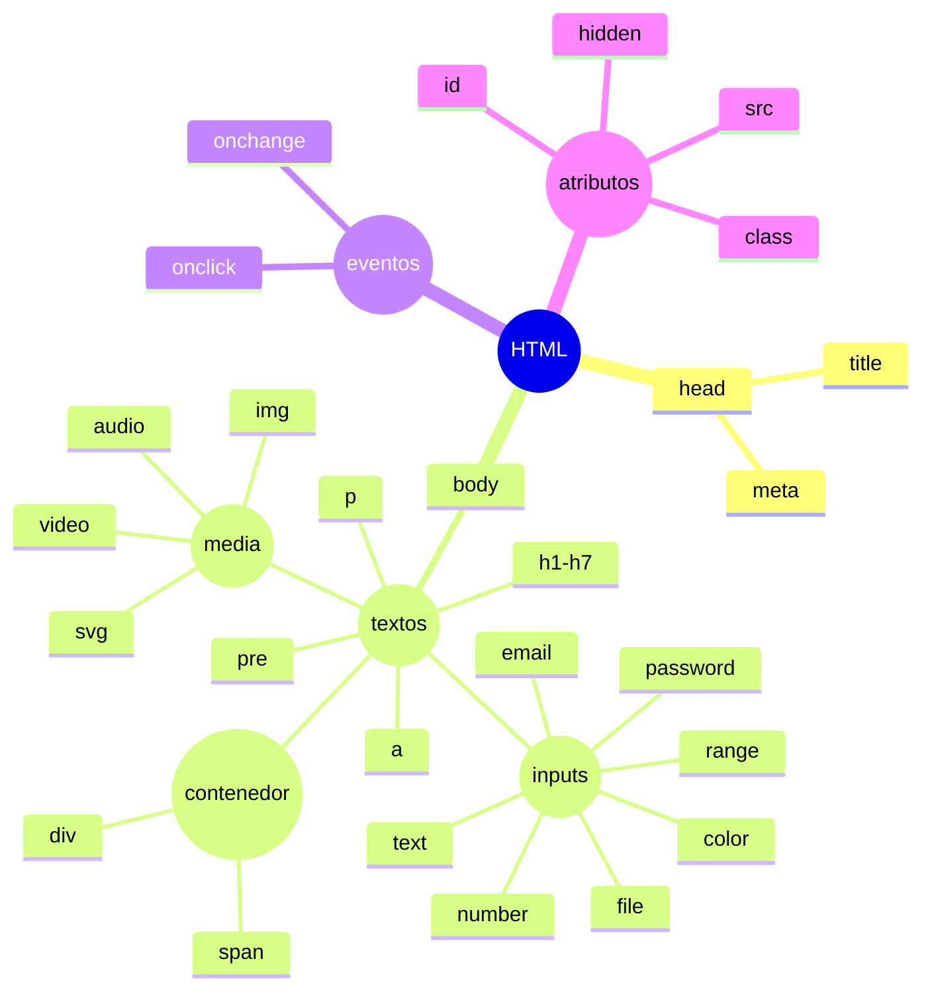

```mermaid
mindmap
root((HTML))
  head
    title
    meta
  body
    ((textos))
     h1-h7
     p
     pre
     a
     ((inputs))
       text
       password
       number
       range
       email
       color
       file
     ((media))
       img
       video
       audio
       svg
     ((contenedor))
       span
       div
  ((eventos))
      onclick
      onchange
  ((atributos))
      id
      class
      src
      hidden
```

